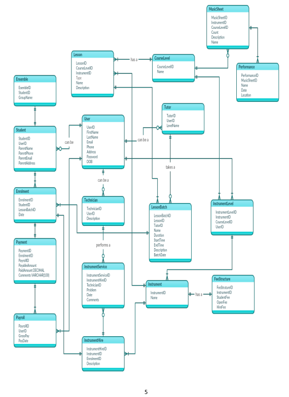

# SMMC -  Saturday Morning Music Class

### SMMC is a large, government supported programme that teaches children and

### adults how to play a range of different orchestral instruments. SMMC also provides

### vocal technique and music theory. Students participate in focussed instrumental

### lessons and scaffold a series of performances.

### SMMC wants to store information about the following:

### 1. Students,

### 2. Lessons,

### 3. Tutors,

### 4. Ensembles,

### 5. Performances,

### 6. Sheet Music,

### 7. Instruments,

### 8. Fee Structure

### SMMC has an extensive library of purchased sheet music. SMMC performs a

### number of public concerts each year. Presently, SMMC records it data manually,

### which is time consuming and error prone.

# Requirement Analysis

### User – Admin, Student, Tutors and Technicians

- Login to the system using an email address and password.
- View an upcoming schedule of events.

### Admin

- Create student, tutor and technician users and assign them specific roles.
- Update a user’s personal information (first name, last name, date of birth, phone number,
    email address, etc.) and role.
- Enrol a student into a lesson.
- Update a student enrolment’s information (date, student and lesson).
- Set hiring fees for an instrument.
- Update an instrument’s hiring fees (instrument, student fee, open fee and hiring fee).
- Set up payments automatically for tutors.
- View upcoming payments for tutors.
- Add a new instrument to the system.
- Update an instrument’s information (name and description).
- Add an instrument’s condition status.
- Update an instrument’s condition information (instrument, name and current condition).
- Add instruments hired by students/open students.
- Update hired instruments by student’s information (code, enrolment and instrument hire).
- Add a ticketing system that services instruments.
- Update existing serviced instrument’s information (problems, date, comments, instrument hire
    and technician).
- Add a new course level which roughly aligns with the Trinity College exams.
- Update a course’s level information (name).
- Add a new type of lesson to the system.
- Update a lesson’s type information (name).
- Add a new lesson to the system.
- Update a lesson’s information (name, instrument, description, course level and lesson type).
- Add a new lesson batch to the system.
- Update a lesson’s batch information (name, date, duration, start time, end time, description,
    lesson and tutor)
- Add a new piece of music to the system.
- Update a music’s piece information (name and description)
- Add a new set of music notes to the system.
- Update a music’s note information (name, count, description, music piece, instrument, course
    level).
- Add a new performance program to the system.
- Update a performance program’s information (date, location and name).
- Add a new performance to the system.
- Update a performance’s information (time, music sheet and performance).
- Dynamically search for information relevant to students, lessons, tutors, ensembles,
    performances, sheet music and instrument.
- View and print information relevant to students, lessons, tutors, ensembles, performances,
    sheet music and instrument in a table format.

### Tutor

- Add a new lesson batch to the system.
- Dynamically search lesson batch information.
- View and print lesson batch information.

### Student/Open Student

- View a timetable/calendar of lessons enrolled.

# Business Rules

### User – Admin, Student, Tutors and Technicians

- A user must have a login to access their dashboard.
- No deletion of users. May be used for data analytics in the future.

### Students

- Students can enrol at the start of February.
- Students can enrol in the year in which they turn five.
- Students can enrol for lessons until they have graduated high school.
- Graduated students must be enrolled in the Open division.
    o **Rationale:** The government doesn’t subsidise lessons after a student has graduated
       from high school. In addition, lesson fees are considerably higher.
- Maintain parents/guardian’s contact information along with all student’s information if they
    are under 18.

### Lessons

- Offer lessons in all traditional orchestral instruments plus recorder, vocal technique and music
    theory.
- Offer lessons at level 0 to 8.
    o **Rationale:** The levels correspond roughly to the levels of the Trinity College exams.
- Assign a tutor to each group lesson which lasts for 30 minutes and start between 8.30 and
    11.30 each Saturday morning.
- A group size must be a minimum of three and a maximum of eight except for recorders where
    group size can be a maximum of 16.

### Tutors

- Tutors must have a level 8 certification in their instrument.
- Senior or head tutor can teach lessons at level 7 or 8.
- Head tutor can teach more than one instrument if he/she is qualified.
- Tutors are added to payroll when they are created.
- Tutors are paid on a scaled hourly basis.

### Ensembles

- Students taking lessons at levels 1, 2 or 3 are automatically enrolled in Training Orchestra.
- Students taking lessons at levels 4, 5 or 6 are automatically enrolled in Junior Sinfonia.
- Students taking lessons at levels 7 or 8 are automatically enrolled in Community Orchestra.
- Students who are not taking lessons, may enrol in Community Orchestra by performing at a
    sufficient level and audition.

### Performances

- A major concert is staged in the Town Hall each September.
- Records are kept of each piece played.
- A piece may not be used for the massed item in a given year if it was used in any of the last
    three years.

### Sheet Music

- Copies of sheets are made and distributed by an administrator and given to tutors, who give
    them to their students.
- All pieces are either for a single instrument or they are orchestral.
- A piece includes parts for many different instruments.

### Instrument

- All instruments except recorder are available for hire.
- Students may only hire instruments for which they are enrolled in lessons.
- Students may use their own instrument if they own one.
- Instrument repairs are handled by qualified technicians.
- Students whose instruments are being repaired are issued with a temporary replacement.

## Entity Relationship Diagram (ERD)

